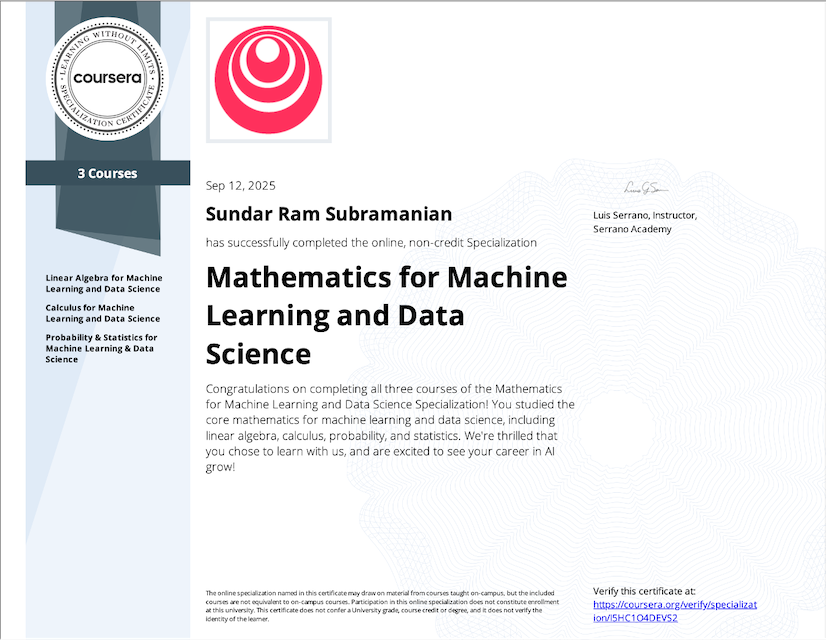

# mathematics_for_ml_ds
This repository contains the mathematical &amp; scientific programming exercises I had used as a part of my course work in Mathematics for Machine Learning & Data Science.

This include both:
> 1. Practise assignment
> 2. Graded Projects

You could verify the certificate at https://coursera.org/verify/specialization/I5HC1O4DEVS2

